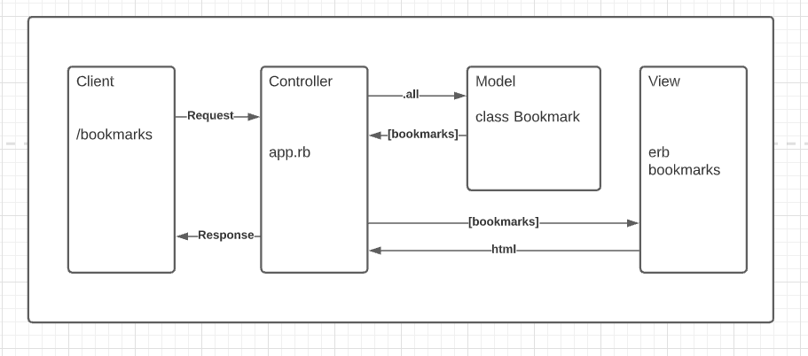

# Bookmark Manager

## Database setup instructions
1. Connect to psql
2. Create the database using the psql command CREATE DATABASE bookmark_manager;
3. Connect to the database using the pqsl command \c bookmark_manager;
4. Run the query we have saved in the file 01_create_bookmarks_table.sql

## User Stories

As a user
I want to see a list of all my bookmarks
So that I can look through them all to find something I've saved

